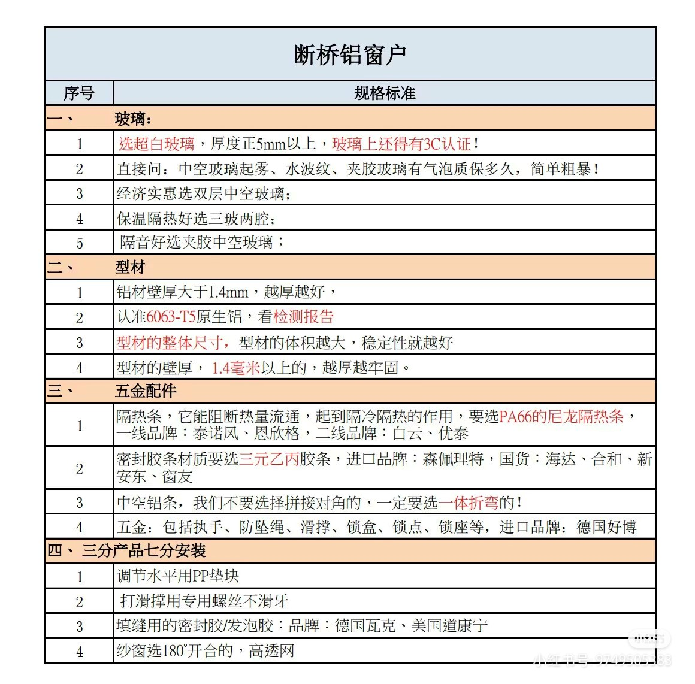

# 门

## 入户门

### 丁字墙
单边无门垛，只能切门套线。告别暗合页(1) 的神将高雅格
{ .annotate }

1.  

### 🕳翻车集锦

- [ ] 春联忘记撕
- [ ] 门楣没有保护，多了几道划痕
- [ ] 保护套没有剪开露出锁芯，导致门锁意外报销

## 卧室门
{: figcaption=1435 style="width:40vw;" }
!!! failure annotate "颜色翻车"
    太懒了，微信看图下单。没有拿着全屋的柜门小样去店里下单(1)
    
1.  

## 厨房门
!!! failure "双层玻璃（5+5）中间未插入{==丰字==}隔条"
    返工

## 卫生间门
{: figcaption=1435 style="width:50vw;" }

!!! warning "门洞超厚没有注意"
    使用了两块门套拼接，丑
!!! warning annotate "公卫门做成了内平内开"

    我给老板提的工艺要求(1) ，她完全没有转发给安装师傅

1.  
    
## 淋浴房

???+ warning "公卫的淋浴房装到了干区"
    {: figcaption=1435 style="width:40vw;" }
    
## 断桥铝
{: figcaption=1435 style="width:50vw;" }

### 一家之言
