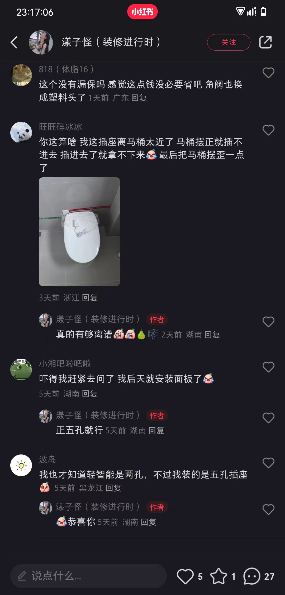
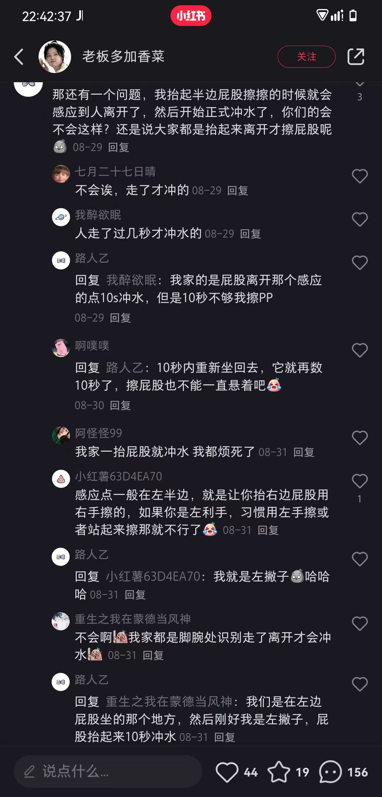
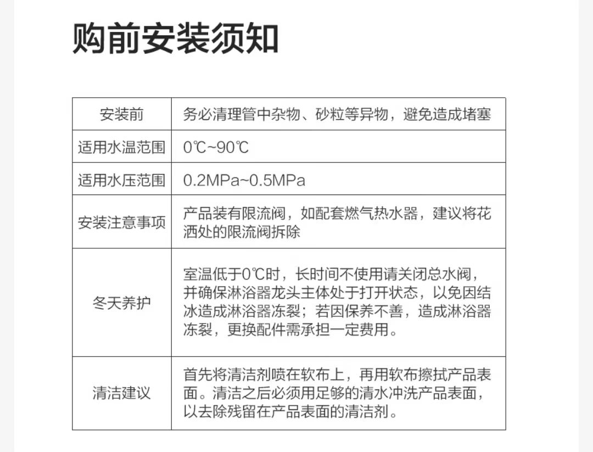
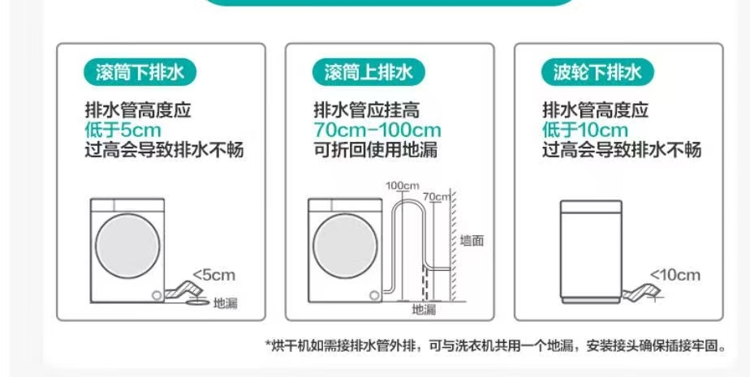

# 家电

## 智能马桶

### 插座问题详见电工板块或者小红书
{: figcaption=1235 style="width:40vw;" }
### 对于左手或者站着擦PP的人不太友好
{: figcaption=1235 style="width:40vw;" }

## 燃气热水器
???+ warning "废水；水小了不点火；中途关一下再开水是凉的。到底谁在推荐燃气热水器呢"
    燃气热水器洗澡的时候，水打开了就尽量不要关
    
### 花洒
{: figcaption=1235 style="width:40vw;" }

## 洗碗机
- 洗碗盐（软化水质），漂洗剂（加速烘干）不管是否使用凝珠都要加，除非你能忍受洗碗机上耗材不足的亮灯提醒
- 定时检查并清理滤网
- 可以使用APP设置烘干时间

## 洗衣机

### 波轮洗衣机的排水
{: figcaption=1235 style="width:40vw;" }

### 滚筒的坑
- ??? failure "洗衣机龙头不适配4分螺纹管"
    
- !!! warning "烘干机的电源线太短"
    只好再买一个插排
