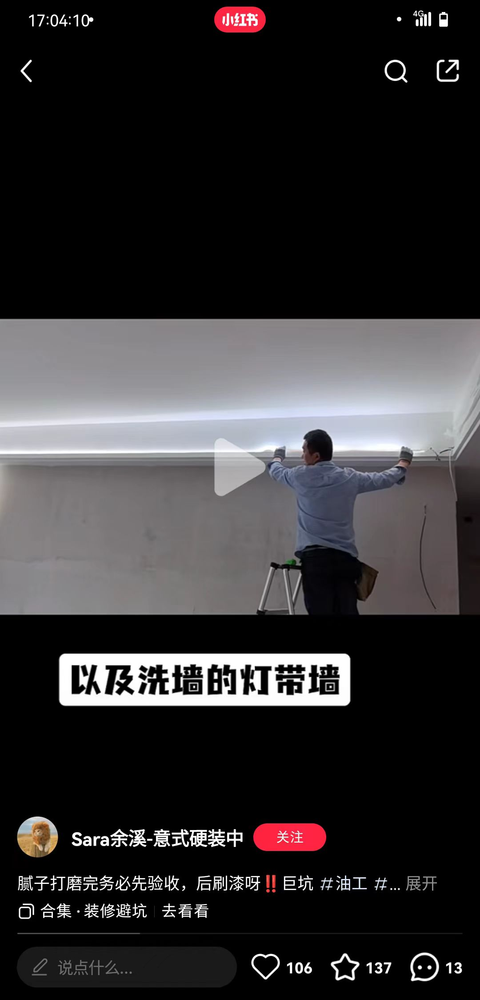
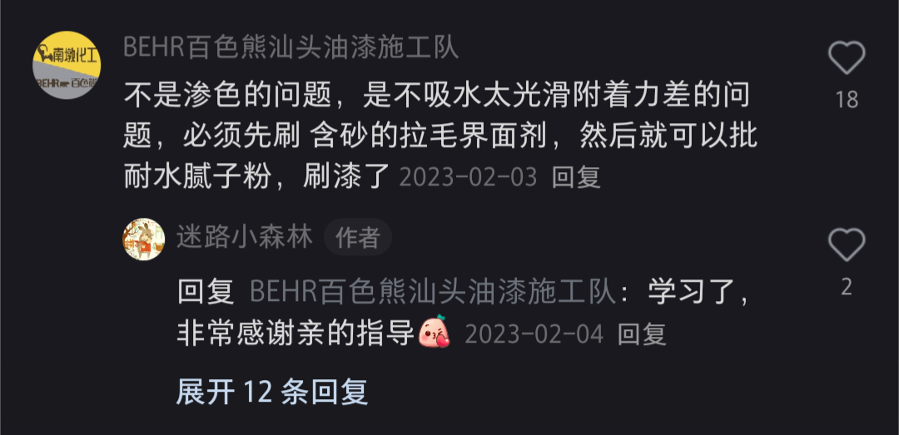

# 油漆

## 工序
{: figcaption=1435 style="width:50vw;" }

## 腻子粉的选择
{: figcaption=1455 style="width:50vw;" }

^^避坑立邦腻子粉^^(1)
{ .annotate }

1.  

## 翻车诡事录
!!! warning "大匠腻子粉送错"
    指定NS730，结果第一次送来的闻所未闻（全网都查不到的）的型号NS0881
!!! warning "刮腻子时没有提前撕掉推拉窗框的保护膜"
    有些地方的膜被腻子粉封死
!!! warning "灯槽（铝合金）的侧面没有批腻子"
    后期只能涂刷 ~~金属漆~~ 乳胶漆
??? warning "线型灯照射到的区域做完腻子没有验收"
    {: figcaption=1485 style="width:50vw;" }
!!! failure "面漆被掉包"
    三桶立邦面漆底部做了记号。油工的口径：==9/18（底漆）并未带走一桶==，9/19（第一遍面漆）上午工人带来三桶调色后的面漆带走一桶，下午油工下带走一桶。那剩下的一桶没调色的面漆应该是做过记号的，然而并没有。==监控瘫痪==，没法了解具体什么时候掉包

## 如何在瓷砖上刷漆
{: figcaption=1475 style="width:50vw;" }

