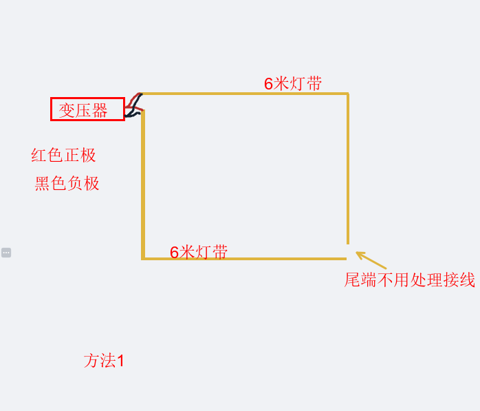
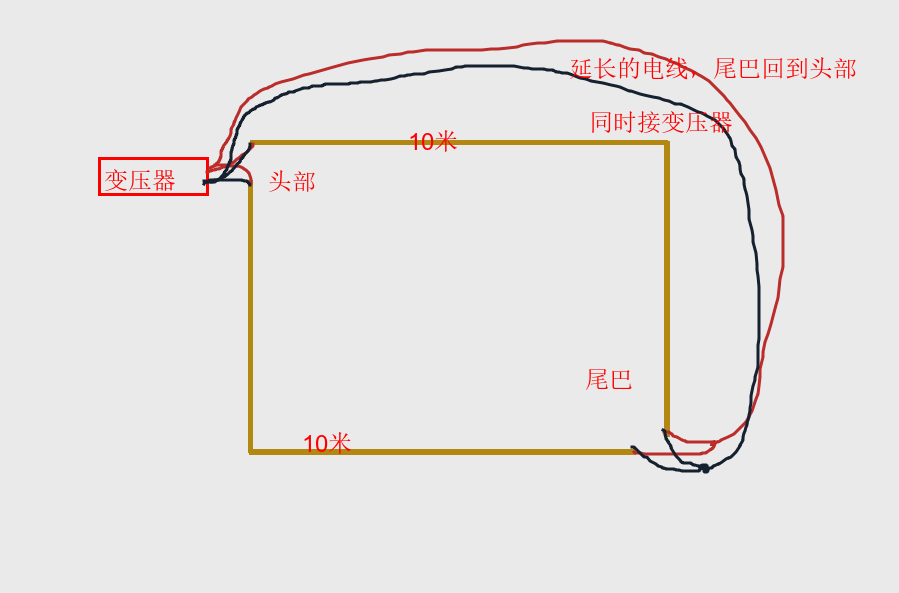

# 水电

## 验收

### 注意事项
- [x] 在这个阶段一并打孔（费用另算）
- [x] 保护地面上裸露的PVC管：①倒沙子②三块木板搭建一个简易的梯形坡供推车运行✔️
- [x] 割槽前做好粉尘防挡
- [ ] 卫生间割槽后还要涂防水，否则积水免不了渗到楼下

## 杞人忧天记

- [x] 地面挖槽担忧打穿层板
- [x] 两个卫生间的铁管割断后会有什么后果

### 灯带接线
??? note "方案一"
    {: figcaption=1885 style="width:50vw;" }
??? note "方案二"
    {: figcaption=1885 style="width:50vw;" }
  
## 翻车实录
!!! failure "主卧的网口设置不当，与窗帘的行进路线冲突"
    只能布放子路由开启有线mesh，被迫打开iptv机顶盒的WiFi连接
!!! failure "阳台洗衣机的下水口距离墙面20CM（<=10CM为佳）"
    洗烘套装只能靠外叠放
!!! failure "厨房下水口切的太短（到底是谁切的，存疑）"
    在橱柜底板需要插入一体式延长管
!!! failure "阳台洗衣机的下水口距离墙面20CM（<=10CM为佳）"
    洗烘套装只能靠外叠放
??? failure "主卧壁灯灯线位置太高且与柜门冲突"
    <video width="640" height="360" controls>
        <source src="../videos/壁灯.mp4" type="video/mp4">
    </video> 
??? failure "客卫马桶插座位置与排污口的距离太短，且使用了内嵌式插座"
    {: figcaption=1435 style="width:50vw;" }
!!! failure "主卫没有预留电热毛巾架的插座"
    无解
!!! failure "厨房预留的插座数量不够"
    尤其是进门左手处
!!! failure "前置过滤器的高度错误"
    高度不足，与橱柜底板”打架“
!!! warning "电视柜区的50管没有及时切除"
    第一次使用角磨机
