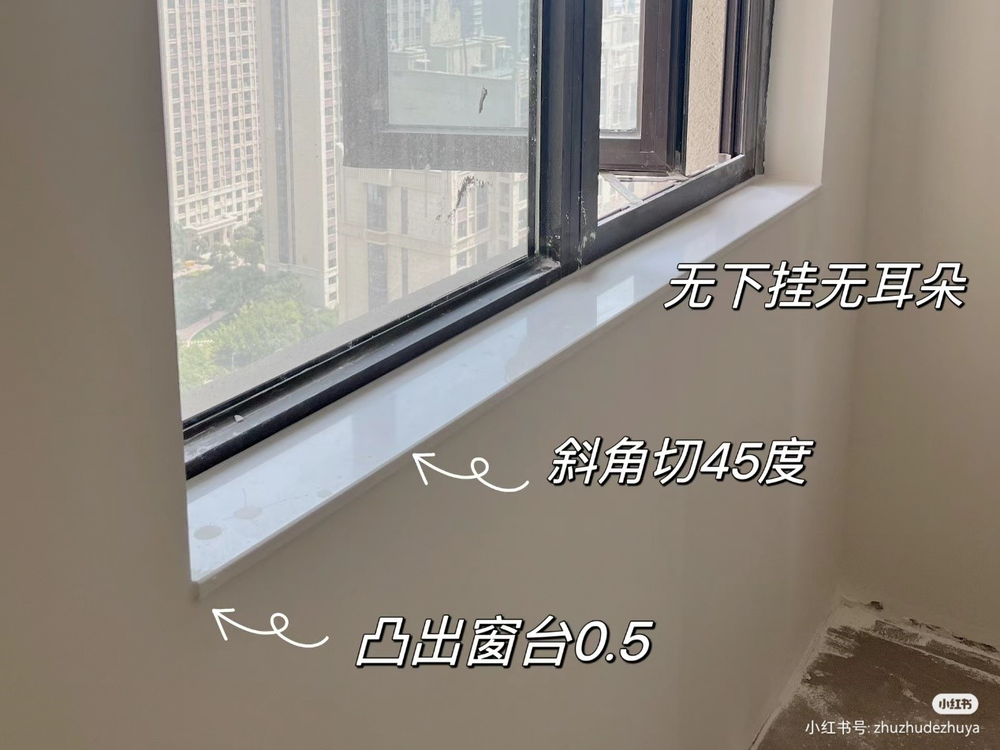
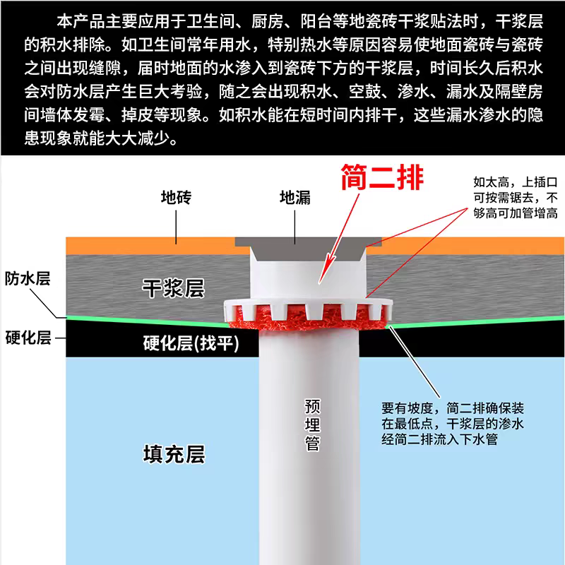

# 瓦工

## 工艺要求
{: figcaption=1235 style="width:60vw;" }

### 附录
(1) 贴砖技术方案 
{ .annotate }

1.  

### 美缝
!!! question "可以放到最后做，所有缝隙一并收口"
    老传统，多找几家比价，然后把报价低的米数少的拎出来压价。我家应该是压缝，乍看还行。但是十字交叉处理的不够好。

## 翻车事件簿

###卫生间
- ??? failure "防水翻车事件梳理"
    
- !!! warning "湿区坡度没有第一时间测试"
    弹珠试验失败
- !!! warning "公卫没有砌门垛"
    欧松板打底，大量用胶
- ??? warning "门洞立面没有贴砖，无法做单包套"
    <video width="640" height="360" controls>
        <source src="../videos/一种单包套的做法.mp4" type="video/mp4">
    </video>   

###厨房
- !!! warning "没有提前告知高低台"
    低台默认80cm高，没有切砖
- !!! warning "墙面没有做到垂平"
    石英石台面与墙面的缝隙大小不一
- !!! warning "燃气管没有用瓷砖包管"
    全屋定制的设计师和装铝扣板的都提过
- !!! info "吊柜背后没有用杂砖"
    至少可以省200

###卧室
- !!! failure "卧室和客厅预留的高差=2.2cm（忘记检查）"
    没有及时实施自流平挽救
- !!! warning "至少两间卧室的水泥开裂"
    不可避免？
- ??? note "窗台石漏装"
     
    
    
###客厅
- !!! failure "小范围空鼓"
    贴砖完第二天就要检查
- !!! warning "入户门处留下另一个巨大的宽隙"
    踢脚线装上后消失   

## 奇技淫巧
???+ note "看起来挺完美的筒二排"
    

